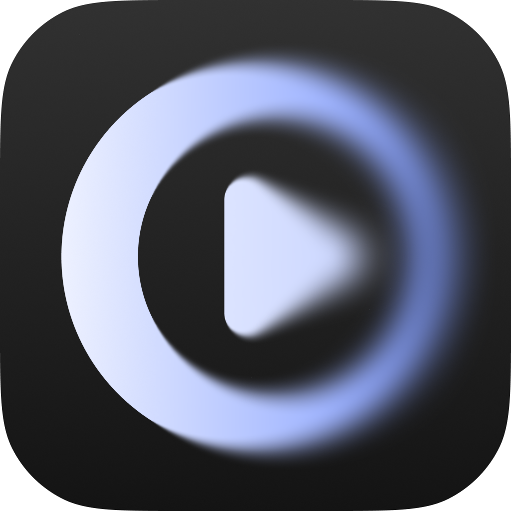
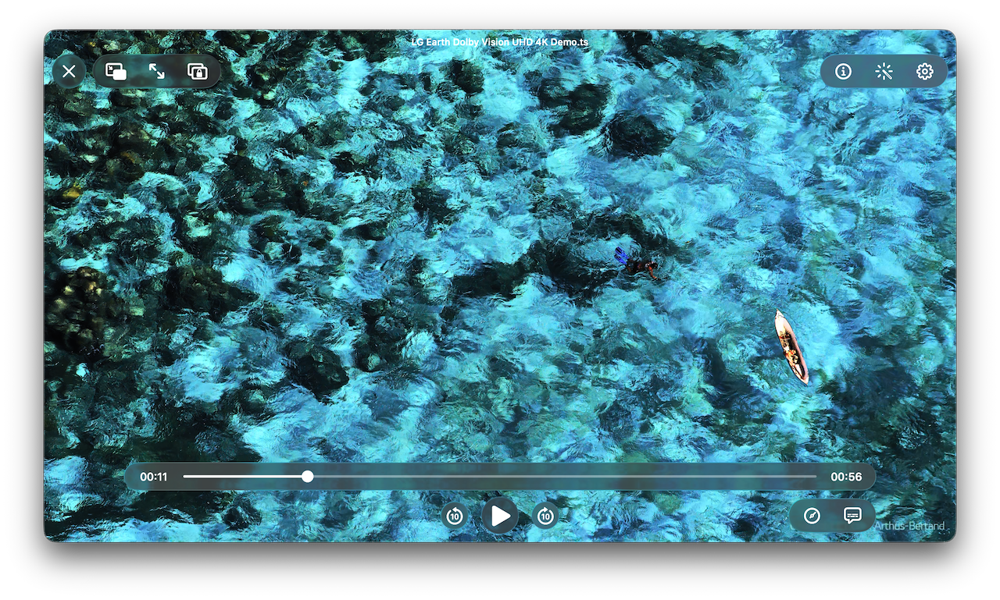

<div align="center">
  <a href="https://cinemore.com.cn/">
    
  </a>
  <h1>CinePlayer For Apple</h1>
  <p><strong>次世代播放器</strong></p>
  <p>
    <a href="README.md">English</a> · <a href="README-zh.md">简体中文</a>
  </p>
  <p>
    <a href="https://apps.apple.com/cn/app/cineplayer/id6759988668">
      
    </a>
  </p>
</div>

CinePlayer 是一款基于 `CinePlayerSDK` 构建的开源播放器。`CinePlayerSDK` 作为 **[Cinemore](https://cinemore.com.cn)** 的播放核心得到了广泛的验证，现在我们将成果进行拓展。它展示了如何利用高性能内核实现极致的音视频播放体验，同时保持了应用层的灵活性和可扩展性。

## 📸 预览

<p align="center">
  
</p>

## ✨ 特性

- **画质与音频**：HLG、HDR10、HDR10+、杜比视界（含 RPU）；硬件解码；立体声/多声道、空间音频、杜比全景声（在支持场景下）。
- **手势与快捷键**：iOS — 单击显隐控制、双击左右快进/快退或中间播放/暂停、长按临时倍速（播放设置中可配置快进秒数与长按倍速）；tvOS — 遥控器滑动/按键快进快退、长按连续快进；macOS — 空格播放/暂停、方向键快进/倍速、Esc 全屏、鼠标移动唤起控制层。
- **字幕**：内嵌与外挂字幕；全 ASS 样式可调；HDR 字幕支持；翻译（如 Apple 翻译）。
- **轨道与媒体信息**：音视频与字幕轨道列表快速切换；媒体信息详情卡片。
- **画面增强**：Anime4K 动漫超分辨率（多档预设，可选 A/B 对比）。
- **播放体验**：进度条拖动带缩略图预览；横竖屏（iOS 旋转锁定）、画面填充、画中画、全屏、倍速调节；macOS 窗口置顶；锁屏与控制中心 Now Playing 控制。
- **蓝光**：ISO、BDMV。
- **平台**：iOS、macOS、tvOS、visionOS。

**杜比视界及杜比全景声由 Apple AVFoundation 的 [AVPlayer](https://developer.apple.com/documentation/avfoundation/avplayer/) 负责处理。**

## 🏗 项目架构与依赖

### 核心播放内核 (Closed Source)

* **CinePlayerSDK:** 本项目的核心播放引擎。它是一个闭源的商业组件，仅以二进制形式提供。
* **Frameworks:** 预编译 SDK 与第三方 framework 二进制体积较大，不直接存放在 git 仓库中。构建前请从 GitHub Release 页面下载 `Frameworks.zip`，并解压到仓库根目录：

```bash
curl -L -o Frameworks.zip https://github.com/cinemore/CinePlayer/releases/latest/download/Frameworks.zip
unzip Frameworks.zip
```

解压后，仓库中应包含 `Frameworks/CinePlayerSDK.xcframework`、`Frameworks/CineFFmpeg.xcframework` 等路径。

## 📚 第三方库列表 (Third-party Libraries)

CinePlayer 的强大功能离不开以下优秀开源项目的支持：

### 核心多媒体框架

* **[FFmpeg](https://github.com/FFmpeg/FFmpeg)**

### 视频与 HDR 处理

* **[dav1d](https://github.com/videolan/dav1d)** (libdav1d)
* **[dovi_tool](https://github.com/quietvoid/dovi_tool)** (libdovi)
* **[uavs3d](https://github.com/uavs3/uavs3d)** (libuavs3d)

### 字幕渲染引擎

* **[libass](https://github.com/libass/libass)**
* **[FreeType](https://github.com/freetype/freetype)**
* **[FriBidi](https://github.com/fribidi/fribidi)** 
* **[HarfBuzz](https://github.com/harfbuzz/harfbuzz)** 
* **[libunibreak](https://github.com/adah1972/libunibreak)** 

### 蓝光支持

* **[libbluray](https://code.videolan.org/videolan/libbluray)** 
* **[libudfread](https://code.videolan.org/videolan/libudfread)**
 
## 🧪 构建与代码签名

在 iOS 真机上运行时，请在 Xcode 中打开 `CinePlayer` iOS Target 的 **Signing & Capabilities**，选择你自己的 **Team**。其他设置保持默认即可用于本地开发。

构建前请先按「项目架构与依赖」中的说明下载并解压预编译 `Frameworks.zip`。

## ⚖️ 授权协议 (License)

本项目采用混合授权模式：

* **源码许可**：见仓库根目录的 [`LICENSE`](LICENSE) 文件。
* **SDK 许可**：CinePlayerSDK 的**正式条款**以各平台 slice 内 `CinePlayerSDK.framework` 中的 **License** 文件为准（macOS 下路径为 `Versions/A/Resources/License`）。完整路径：`Frameworks/CinePlayerSDK.xcframework/<平台>/CinePlayerSDK.framework/...`。

本仓库所引用的第三方库（FFmpeg、libass 等）均依各自许可证使用，见上文「第三方库列表」中的链接。

### 1. 开源部分

**CinePlayer** 应用层源码基于 **[Apache License 2.0](https://www.apache.org/licenses/LICENSE-2.0)** 协议开源。你可以自由地学习、修改并基于本仓库代码开发自己的应用。

### 2. 闭源组件与商业授权

**CinePlayerSDK**（通过 GitHub Releases 分发的预编译二进制）为专有软件，**正式条款**以 SDK 内 License 文件为准。禁止对 SDK 二进制进行逆向工程、反编译或反汇编。

**仅针对本仓库**，授权方允许：

* **仅允许个人使用**：`CinePlayerSDK` 仅限个人使用。未经书面许可不得再分发、再许可或用于商业用途。
* **商业用途**：任何第三方公司**严禁**在未获书面许可前将 `CinePlayerSDK` 用于商业产品。
* **商业授权**：商业使用或再分发权利请联系：`cinemore@cinemore.com.cn`。
